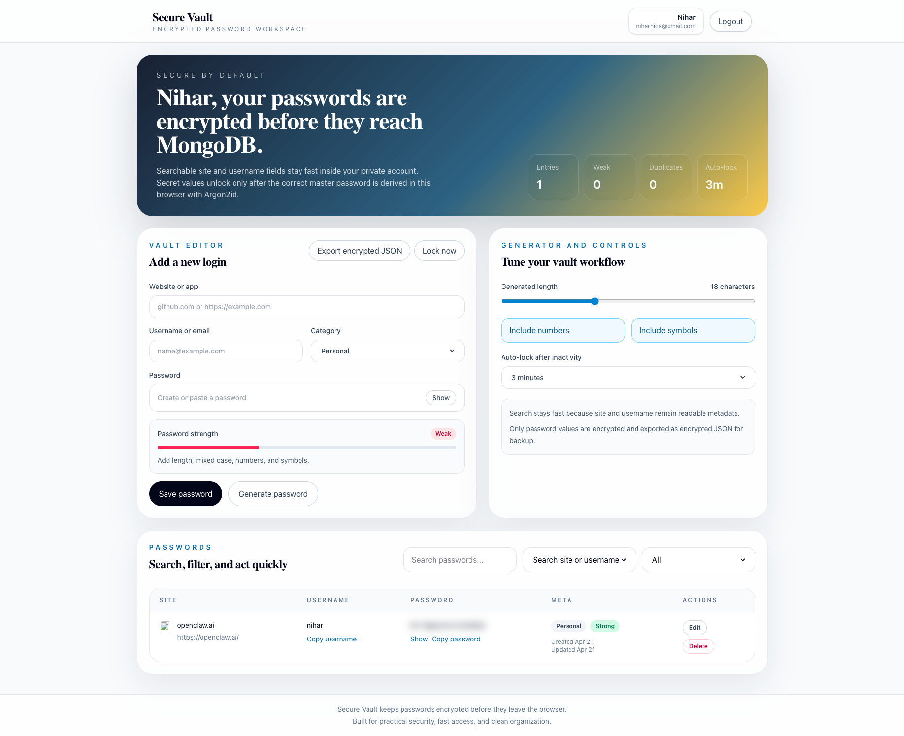

# Secure Vault



Secure Vault is a modern password manager built with React, Vite, Express, and MongoDB. Passwords are encrypted in the browser with a master password before they are stored, so MongoDB never receives raw secret values.

## What changed

- Master password onboarding and unlock flow
- Client-side AES-GCM password encryption using the Web Crypto API
- Search and filtering by site, username, and category
- Copy username and password actions
- Password generator with configurable length, numbers, and symbols
- Password strength indicator, weak-password hints, and duplicate detection
- Auto-lock after inactivity
- Encrypted JSON export for backups
- Favicon display, created and updated dates, and mobile card layout
- Per-user accounts with isolated vault data
- Access tokens kept in memory only
- Rotating refresh tokens stored in httpOnly cookies
- Backend auth validation, rate limiting, and secure headers

## Security model

- Site and username stay readable so search and filtering remain fast.
- Password values are encrypted locally with a key derived from the master password using Argon2id.
- The backend stores encrypted password blobs, IVs, and non-secret metadata only.
- The master password is not stored.
- Access tokens are short-lived and kept only in frontend memory.
- Refresh tokens are rotated and stored in httpOnly cookies so they are not readable from JavaScript.
- Backend routes are protected with JWT bearer auth, zod validation, rate limiting, and Helmet.

## Session flow

- `POST /api/auth/register` creates an account, issues a short-lived access token, and sets a rotating refresh-token cookie.
- `POST /api/auth/login` does the same for existing users.
- `POST /api/auth/refresh` reads the httpOnly cookie, rotates the refresh token, and returns a new in-memory access token.
- `POST /api/auth/logout` clears the refresh cookie and invalidates the stored refresh session.
- The frontend no longer stores JWTs in local storage.

## Run the app

### Frontend

```bash
npm install
npm run dev
```

### Backend

Create `backend/.env` with your Mongo connection string:

```env
MONGO_URI=your_mongodb_connection_string
PORT=3000
JWT_SECRET=use_a_long_random_secret_here
FRONTEND_ORIGIN=http://localhost:5173
NODE_ENV=development
```

Then run:

```bash
cd backend
npm install
npm run dev
```

## Vercel deployment

This project can be deployed to a single Vercel project with the Vite frontend and a serverless Express API under `/api`.

### Vercel environment variables

Add these in the Vercel project settings:

```env
MONGO_URI=your_mongodb_connection_string
JWT_SECRET=use_a_long_random_secret_here
FRONTEND_ORIGIN=https://your-vercel-domain.vercel.app
NODE_ENV=production
```

Optional:

```env
VITE_API_URL=
```

Leave `VITE_API_URL` empty unless you want to point the frontend at a separate backend. By default, the frontend now uses same-origin `/api` requests in production.

### Deploy steps

1. Push this codebase to your existing GitHub repository.
2. Import that repository into Vercel.
3. Keep the framework preset as Vite.
4. Add the environment variables above.
5. Deploy.

The deployment uses serverless API entrypoints in `api/` and the frontend build output in `dist/`.

## Moving this code into your existing Git repo

If your older repository already contains the earlier local-storage-only version, the safest path is:

```bash
git clone <your-existing-repo-url>
cd <your-existing-repo-folder>
rsync -av --exclude .git --exclude node_modules --exclude dist /path/to/this/project/ ./
git status
git add .
git commit -m "Upgrade password manager to full-stack encrypted vault"
git push origin main
```

If you already have both folders locally, you can also copy this project into the existing repo folder manually, then run `git status`, `git add .`, `git commit`, and `git push`.

## API overview

- `POST /api/auth/register` creates an account and starts a cookie-backed session
- `POST /api/auth/login` signs in and starts a cookie-backed session
- `POST /api/auth/refresh` rotates the refresh token and returns a new access token
- `POST /api/auth/logout` invalidates the refresh session and clears the cookie
- `GET /api/auth/me` loads the current user from the bearer access token
- `GET /api/meta` loads vault metadata
- `POST /api/meta` initializes the vault metadata once
- `GET /api/passwords` returns encrypted records
- `POST /api/passwords` creates an encrypted password record
- `PUT /api/passwords/:id` updates an encrypted password record
- `DELETE /api/passwords/:id` deletes a password record

## Notes

- Existing plaintext records from an older version should be re-entered into the encrypted vault.
- Exported backups stay encrypted and can be restored later with the same master password.
- Existing legacy global records are still separate from the new per-user model until migrated.
- For production, use HTTPS so `secure` cookies can be enforced for refresh tokens.
